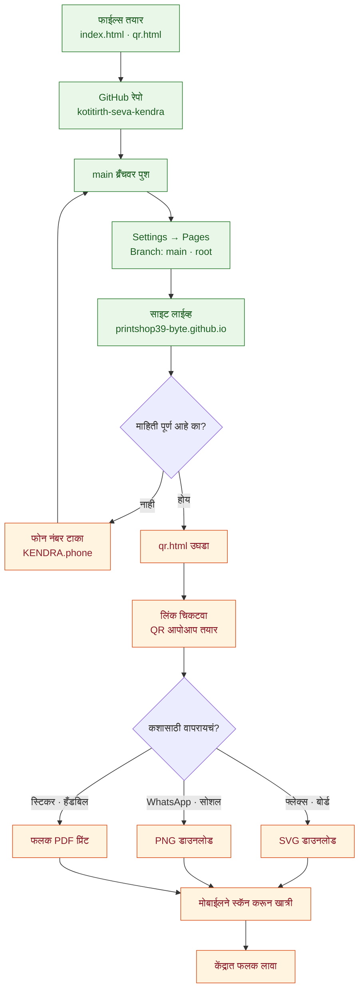
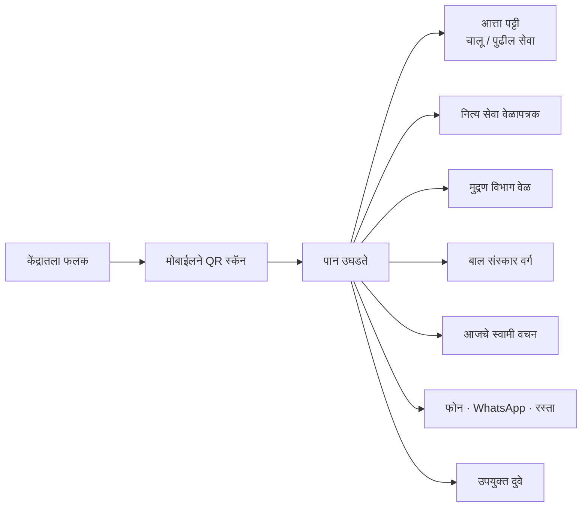
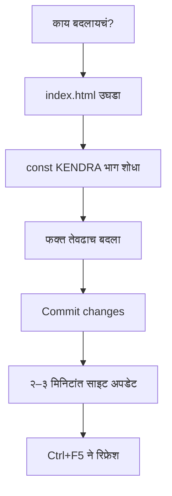
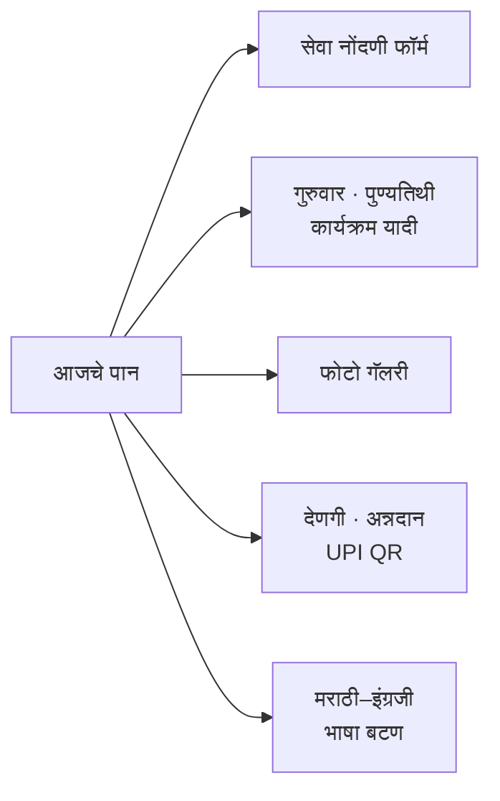

# योजना — आपण काय करणार होतो, कुठवर आलो

श्री स्वामी समर्थ सेवा केंद्र, कोटितीर्थ – कोल्हापूर
संपूर्ण कामाचा प्रवाह, सद्यस्थिती आणि पुढच्या पायऱ्या.

---

## एका नजरेत

| # | पायरी | स्थिती |
|---|---|---|
| १ | फाईल्स तयार करणे (`index.html`, `qr.html`) | ✅ झालं |
| २ | GitHub रेपो तयार करणे | ✅ झालं |
| ३ | फाईल्स रेपोत टाकणे (`main` ब्रँच) | ✅ झालं |
| ४ | GitHub Pages चालू करणे | ✅ झालं |
| ५ | साइट लाईव्ह तपासणे | ✅ झालं |
| ६ | उपयुक्त दुवे जोडणे | ✅ झालं |
| ६अ | सेवा विभाग सेक्शन जोडणे | ✅ झालं |
| ६ब | वार्षिक उत्सव तक्ता + परंपरा | ✅ झालं |
| ६क | श्रावण विशेष — सण, व्रते, दिवसमोजणी | ✅ झालं |
| ७ | **फोन नंबर टाकणे** | ⬜ बाकी |
| ८ | वेळापत्रकातली ओव्हरलॅप दुरुस्त करणे | ✅ झालं |
| ९ | **QR तयार करून प्रिंट करणे** | ⬜ बाकी |
| १० | **फलक/स्टिकर लावणे** | ⬜ बाकी |

**लाईव्ह लिंक:** https://printshop39-byte.github.io/kotitirth-seva-kendra/

---

## संपूर्ण प्रवाह



---

## भाविक हे पान कसे वापरतो



> **खर्च शून्य.** सर्व्हर नाही, डेटाबेस नाही, दरमहा बिल नाही — फक्त HTML फाईल्स GitHub वर.

---

## माहिती बदलायची असेल तर



`KENDRA` मध्ये काय काय बदलता येतं:

| ओळ | काय बदलते |
|---|---|
| `sevekari` | सेवेकऱ्याचे नाव |
| `phone` | फोन नंबर — फोन व WhatsApp बटणांसाठी |
| `mapQuery` | Google Maps वरचा पत्ता |
| `seva[]` | नित्य सेवा वेळापत्रक |
| `mudran[]` | मुद्रण विभागाच्या वेळा |
| `balsanskar[]` | बाल संस्कार वर्गाच्या वेळा |
| `links[]` | उपयुक्त दुवे |
| `vachane[]` | रोजची स्वामी वचने |

⚠️ वेळ नेहमी **२४ तासांच्या** फॉरमॅटमध्ये — `18:00` म्हणजे सायं. ६:००. पान आपोआप मराठी अंकांत दाखवते.

---

## झालेलं काम — तपशील

- **`index.html`** — मोबाईलसाठी बनवलेलं एकपानी माहिती पान
  - "आत्ता" पट्टी — कोणती सेवा चालू आहे, नाहीतर पुढच्या सेवेला किती वेळ बाकी
  - नित्य सेवा टाइमलाइन — चालू सेवा हळदी रंगात हायलाइट
  - मुद्रण विभाग व बाल संस्कार वर्गाच्या वेळा
  - आजचे स्वामी वचन — तारखेनुसार रोज आपोआप बदलते
  - फोन · WhatsApp · Google Maps रस्ता · लिंक शेअर बटणे
  - उपयुक्त दुवे — दिंडोरी प्रणित संकेतस्थळ, धार्मिक ग्रंथ
- **`qr.html`** — QR तयार करण्याचे स्वतंत्र पान (SVG / PNG / फलक PDF)
- **`README.md`** — वापराच्या सूचना
- **GitHub Pages** — `main` ब्रँच, `/ (root)` वरून लाईव्ह

---

## बाकी असलेलं काम

### १. फोन नंबर
`index.html` मध्ये `phone : "+91XXXXXXXXXX"` — इथे खरा नंबर टाकेपर्यंत फोन आणि WhatsApp बटणं फिकट राहतील आणि त्यांवर "नंबर टाका" दिसेल.

### २. QR प्रिंट
`qr.html` उघडून SVG किंवा फलक PDF घ्या. प्रिंटचे नियम त्याच पानावर दिले आहेत:

- कमीत कमी **३ × ३ सेमी**; बोर्डवर **८–१० सेमी**
- चारही बाजूंनी पांढरी जागा सोडा — QR ला चिकटून मजकूर नको
- गडद QR, पांढरी पार्श्वभूमी (उलटं चालत नाही)
- वर "स्कॅन करा — सेवा वेळापत्रक" अशी ओळ टाका
- **प्रिंटआधी स्वतः एकदा स्कॅन करून खात्री करा**

---

## पुढे वाढवता येईल



---

## फाईल रचना

```
kotitirth-seva-kendra/
├── index.html    ← मुख्य पान (QR स्कॅन केल्यावर हेच दिसते)
├── qr.html       ← QR तयार करण्याचे पान
├── README.md     ← वापराच्या सूचना
└── PLAN.md       ← हा दस्तऐवज
```
